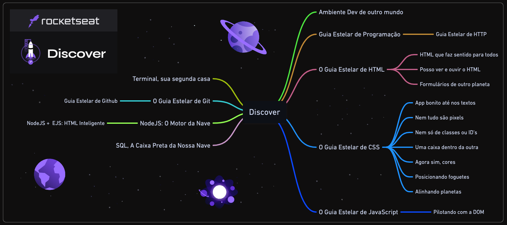
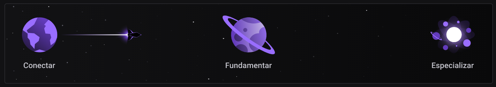

# Rocketseat - Discover

## Módulos

<!-- ❌✅ -->

### 🚀 **Equipando sua nave**

1. ✔️ Ambiente dev de outro mundo
1. ✔️ Terminal, sua segunda casa

#

### 📚 **Guias estelares**

1. ✔️ Guia Estelar de Programação
1. ✔️ Guia Estelar de HTTP
1. ✔️ O Guia Estelar de HTML
1. ✔️ O Guia Estelar de CSS
1. ✔️ O Guia Estelar de JavaScript
1. ✔️ Guia Estelar de Git
1. ✔️ Guia Estelar de Github

#

### 👨🏽‍🚀 **Preparação de astronautas**

1. ✔️ (HTML) Formulários de outro planeta
1. ✔️ (HTML) HTML que faz sentido, para todos
1. ✔️ (HTML) Posso ver e ouvir o HTML
1. ❌ (JS) Pilotando com a DOM
1. ❌ (CSS) Nem tudo são pixels
1. ❌ (CSS) Nem só de classes ou ID's
1. ❌ (CSS) Uma caixa dentro da outra
1. ❌ (CSS) App bonito, até nos textos
1. ❌ (CSS) Posicionando foguetes
1. ❌ (CSS) Agora sim, cores
1. ❌ (CSS) Alinhando os planetas

#

### 🛰️ **Viajando ao espaço**

1. 🔄 NodeJS: O Motor da Nave
1. ❌ NodeJS + EJS: HTML Inteligente
1. ❌ SQL, a caixa preta da nossa nave

#

## Trilhas

<!-- ❌✅ -->

### 🌎 Conectar

1. ✔️ Guia Estelar de Programação
1. ✔️ Computador, Software e Hardware ✨
1. ✔️ Internet, Roteadores e Servidores ✨
1. ✔️ Sistemas Operacionais ✨
1. ✔️ Tipos de Aplicações WEB ✨
1. ✔️ Linguagem de Programação ✨
1. ✔️ Ambiente Dev

#

### 🪐 Fundamentar

1. ✔️ Guia Estelar de HTML
1. ✔️ Guia Estelar JavaScript
1. ❌ Pilotando com a DOM
1. ✔️ Terminal
1. 🔄 NodeJS
1. ❌ Node + EJS
1. ❌ SQL
1. ✔️ Estrutura de Dados  ✨
1. ✔️ Programação Orientada a Objetos ✨
1. ✔️ Programação Funcional ✨
1. ✔️ Guia Estelar de Git
1. ✔️ Guia estelar de Github
1. ✔️ Guia Estelar de HTTP
